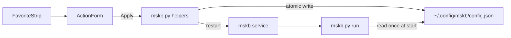

# GTK4 Favorites mapper UI

## Job to be done

Quando eu aperto uma tecla My Favorites, quero escolher na hora o que ela faz (abrir um app, um atalho do sistema, ou um comando) sem editar JSON nem lembrar o id da tecla.

## Executive Summary

Uma janela nativa (Python + GTK4 + libadwaita) edita só as 6 teclas que o `hid-generic` descarta. Apply grava `~/.config/mskb/config.json` e dá `systemctl --user restart mskb.service`. Sem hot-reload, sem escuta hidraw, sem teclado QWERTY.

## Technical Approach

**Ponytail holding rungs:** persist/restart already exist (rung 2). App list is Gio (rung 4). Tests are `unittest` (rung 3). GUI is GTK4/libadwaita already on Zorin 18 (rung 4). Stop there: no pip deps, no GJS, no extra daemon, no SIGHUP, no hidraw in the GUI.

### End-to-end flow




- **Window:** `python3 mskb.py gui` opens [mskb_gui.py](mskb_gui.py) (lazy-imported so `probe`/`run` never load GI). First launch also writes `~/.local/share/applications/mskb.desktop` (same home-user pattern as the systemd unit in `_install_user_service`).
- **Domain contract (JSON, unchanged):** each binding is `{ "key": "...", "exec": "..." }`. The GUI does **not** add fields. Exclusive modes are a write-time projection:
  - Open app / Command → `exec` set, `key` cleared
  - System shortcut → `key` set (F13–F24), `exec` cleared
  - Nothing → both `""`
- **Load of dual-fire bindings** (today's Obsidian+F14 example): treat as Command/App (`exec` wins). Next Apply drops `key`. Mapper behavior for unsaved dual bindings stays as-is until Apply.
- **Persistence:** extract `save_config` next to `load_config` / `ensure_config` in [mskb.py](mskb.py) (lines 384–405). `cmd_learn` (lines 647–656) must use it. Atomic write (`*.json.tmp` + `replace`) so a crash does not truncate the file. Merge: GUI writes only the six favorite ids; any extra ids from `learn` stay.
- **Restart:** reuse `_systemctl_user(["restart", "mskb.service"])`. Config is saved even if restart fails; toast explains that. If the unit is inactive, toast tells the user to `systemctl --user enable --now mskb.service` — GUI does not start a second mapper.
- **App picker:** `Gio.AppInfo.get_all()` + `should_show()`, not a file chooser. Command stored after `strip_field_codes` (drop `%U`/`%F` and Flatpak `@@…@@` / `--file-forwarding`) so we never copy a `.desktop` Exec line as-is.

### UI (libadwaita 1.1 widgets — Ubuntu 22.04+)

Do **not** use `AdwToolbarView` (1.4), `AdwToggleGroup` (1.7), or `AdwSpinner` (1.6). Zorin 18 has 1.5; 22.04 has 1.1.

- `Adw.ApplicationWindow` (~560×480) + `Adw.HeaderBar` + `Adw.ToastOverlay`
- Header title: Microsoft Keyboard. Primary action: **Apply** (`suggested-action`), insensitive until dirty
- Favorite strip: `Gtk.Box` + `linked` toggle buttons, exclusive group, order `★ 1 2 3 4 5` (`favorites_star` … `favorites_5`)
- `Adw.PreferencesGroup` with:
  - `Adw.ComboRow` Action: Open app / System shortcut / Command / Nothing
  - `Gtk.Stack` value row: app `ComboRow` (searchable if cheap; otherwise sorted list) **or** F-key `ComboRow` (F13–F24, plus the current value if it is outside that set) **or** `Adw.EntryRow` command
- Missing GI/GTK: `cmd_gui` exits with the apt line `python3-gi gir1.2-gtk-4.0 gir1.2-adw-1`
- Copy in English (matches CLI and [docs/usage.md](docs/usage.md)). Follow `gnome-dev-ui` + `ux-writing-skill`: header caps on labels, sentence case on descriptions, no "OK"/"Submit"

### Out of scope (rung 1)

Full keyboard, media/mail/calc keys, live key highlight (hidraw is already held by the mapper), hot-reload, i18n, changelog directory (repo has none).

### Tests (stdlib `unittest` — no pytest)

No Pest/Jest in this repo. New [tests/test_config_actions.py](tests/test_config_actions.py) imports helpers from `mskb` only (no `gi`). Runner: `python3 -m unittest`.

## Task Checklist

- [ ] **Helpers in mskb.py:** `strip_field_codes`, `kind_for_binding`, `binding_for_kind`, `save_config` (atomic, chown, merge). Point `cmd_learn` at `save_config`. `ponytail:` exclusive write drops dual-fire; ceiling = checkbox later if someone wants both.
- [ ] **Tests for helpers:** round-trip none/key/command; dual-fire loads as command and save clears `key`; Flatpak/`%U` stripping; extra learned ids survive a favorite-only save; current key outside F13–F24 is preserved until changed. Run `python3 -m unittest`.
- [ ] **GUI window:** [mskb_gui.py](mskb_gui.py) with strip + stack form + dirty/Apply + toasts. `cmd_gui` lazy-import + desktop-file ensure. Follow gnome-dev-ui compliance (header bar, ComboRow, symbolic `input-keyboard`, accessible names on icon-only controls).
- [ ] **Install path:** `cmd_install` also writes the `.desktop` (same `$SUDO_USER` home as the unit).
- [ ] **Docs:** [docs/usage.md](docs/usage.md) section 3 — GUI as the default way to assign keys; JSON remains the source of truth. One line in [README.md](README.md). Apt packages + Ubuntu 22.04+ note.

## Verification Plan

**Automated (required, same workstream):**

```bash
python3 -m unittest
```

Expect all new cases green: mode mapping, dual-fire coercion, exec sanitization, merge save, atomic JSON round-trip.

**Manual (GTK cannot be asserted in unittest here):**

- `python3 mskb.py gui` on this Zorin 18.1 session
- Bind Favorite 1 to an installed Flatpak (Obsidian): config `exec` has no `%U`/`@@`; `key` is `""`
- Apply → `systemctl --user is-active mskb.service` still `active`; physical key launches the app once
- Bind Favorite 2 to F15, Apply, record F15 in Zorin Settings
- Bind Favorite 3 to a raw command, then Nothing — both fields empty in JSON
- Keyboard-only: Tab through strip and form, Apply with Enter
- `GTK_THEME=Adwaita:hc python3 mskb.py gui` still readable
- Menu entry appears after first launch (`mskb.desktop`)

## Skills

- `ponytail.mdc` — already holding at rungs 2–4; do not add layers during impl
- `gnome-dev-ui` — widgets, header bar, toasts, a11y checklist (read before writing UI)
- `ux-writing-skill` — Apply / Action / toast strings
- `code-discovery` subagent — before adding helpers, confirm nothing equivalent exists beyond `load_config` / `cmd_learn` write
- `code-comments` — file header on `mskb_gui.py`; why on exclusive-mode and field-code strip
- `agent-memory` — persist the exclusive-write contract under `.cursor/memories/project-knowledge/`
- Pest / Jest: not used in this repo

